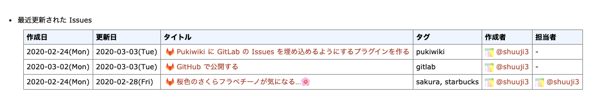

# pukiwiki-plugin-gitlab-issues

 🦊 Pukiwiki plugin to show the table listing GitLab issues.



## Usage

```
#gitlab_issues([domain],[api_token],[project_id],[limit = 10])
```

### Parameters

| Name | Description |
| -- | -- |
| domain | GitLab domain name on your site. i.e. `gitlab.gnome.org` |
| api_token | API token to read issues information |
| project_id | Project ID you want to show issues |
| limit (optional) | Issue count to show on the table |

## References

- [doc/api/api_resources.md · master · GitLab.org / GitLab · GitLab](https://gitlab.com/gitlab-org/gitlab/blob/master/doc/api/api_resources.md)

## License

[GNU GPLv3](LICENSE)
